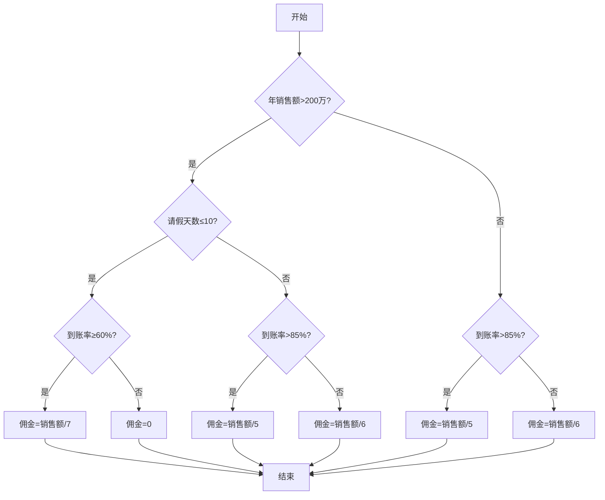

# 软件测试

## 1. 判断三角形类型

### 问题描述

- 输⼊三个整数a,b,c,作为三角形三条边，通过程序判断三条边构成的三角形类型：
  - ⼀般三角形
  - 等边三角形
  - 等腰三角形
  - 不构成三角形
- a<b+c; b<a+c; c<a+b;
- 1<=a<=256;1<=b<=256;1<=c<=256

### 采用边界值法：

1. 规定各边取值范围为[1,256]，各边正常值为 128
2. 假定固定住 a，b 的值
3. 得出对于c的限制条件，|a - b|< c < a + b
4. 进一步得出，max( 0, |a - b| ) < c < min( 257, a + b )
5. 采用健壮边界值：
   1. a，b，c 的取值依赖于其他两项的取值，因此采用健壮性边界值
   2. 除了取最小值、比最小值大的值、正常值、比最大值小的值、最大值外，再取⼀个略高于最大值的值和略小于最小值的值

| a   | b   | c   | 预期结果   |
| --- | --- | --- | ------ |
| 0   | 128 | 128 | 输入越界   |
| 1   | 128 | 128 | 等腰三角形  |
| 3   | 128 | 128 | 等腰三角形  |
| 254 | 128 | 128 | 等腰三角形  |
| 256 | 128 | 128 | 不构成三角形 |
| 258 | 128 | 128 | 输入越界   |
| 128 | 0   | 128 | 输入越界   |
| 128 | 1   | 128 | 等腰三角形  |
| 128 | 3   | 128 | 等腰三角形  |
| 128 | 254 | 128 | 等腰三角形  |
| 128 | 128 | 128 | 等边三角形  |

## 3. 年终考评模块边界值分析与测试

### 问题描述

在一销售管理系统中，其中的一个模块负责对公司员工进行年终考评，考评综合考虑职工在公司工作时间长短（计年）、每年请假的次数（不能超过20天，20天以上，包括20天，则免于年终考评）、员工在公司的级别（分1，2，3，4，5个级别）及本年度的销售总额，考评的结果最高以5分计，公司成立于2000年初，该软件的设计使用周期到2035年底。

#### 输入变量：

- 工作时间长短（年）：2000~2035年，实际取值范围为[0, 35]（假设2000年入职，2035年为最大）
- 每年请假天数：[0, 19]，20天及以上免于考评
- 员工级别：[1, 5]
- 本年度销售总额：[0, +∞)

### (1) 基本边界值和最坏情况边界值测试用例数量

- 工作时间长短（年）：最小值0，最小值+1=1，正常值=中间值=17，最大值=35，最大值-1=34
- 请假天数：最小值0，最小值+1=1，正常值=10，最大值=19，最大值-1=18
- 员工级别：最小值1，最小值+1=2，正常值=3，最大值=5，最大值-1=4
- 销售总额：最小值0，最小值+1=1，正常值=10000，最大值=假设1000000，最大值-1=999999

#### 基本边界值法

- 每个变量取最小值、最大值、正常值，共3个值
- 变量数n=4
- 测试用例数= n*2+1 = 4*2+1 = 9

#### 最坏情况边界值法

- 每个变量取最小值、最小值+1、正常值、最大值-1、最大值，共5个值
- 变量数n=4
- 测试用例数= 5^4 = 625

### (2) 健壮边界值法下"工作时间长短"为非正常值的测试用例

- 健壮边界值法：在基本边界值基础上，增加略小于最小值和略大于最大值的情况
- 工作时间长短正常范围[0,35]，非正常值为-1和36

| 用例编号 | 工作时间长短（年） | 请假天数 | 员工级别 | 销售总额  | 预期结果    |
| ---- | --------- | ---- | ---- | ----- | ------- |
| 1    | -1        | 10   | 3    | 10000 | 非法输入/报错 |
| 2    | 36        | 10   | 3    | 10000 | 非法输入/报错 |

## 5. 边界值测试可以适用于function(method) level，class level,，system level，分析电商平台系统测试时考虑的边界值情况。

## 边界值测试在不同级别的应用

### 1. 方法级(Function/Method Level)边界值测试

在方法级别，边界值测试主要关注单个函数或方法的输入参数边界：

- 数值型参数的上下限
- 字符串长度的最小最大值
- 集合/数组的边界大小
- 布尔值的边界情况

### 2. 类级(Class Level)边界值测试

在类级别，边界值测试关注类与类之间交互时的边界条件：

- 类属性的有效范围
- 类方法组合调用时的边界情况
- 类状态转换的边界条件

**示例**：电商平台的购物车类

- 购物车商品数量上限(如100件)
- 购物车总金额上限(如100万元)
- 特殊商品(如限购商品)的边界

### 3. 系统级(System Level)边界值测试

在系统级别，边界值测试关注整个系统的边界行为：

- 系统性能边界(最大并发用户数)
- 数据存储容量边界
- 网络带宽边界
- 第三方接口调用限制

## 电商平台系统测试中的边界值情况

### 1. 用户账户相关边界

- 用户名/密码长度边界(如4-20字符)
- 用户年龄边界(如13岁以上才能注册)
- 用户积分上限/下限
- 用户登录失败尝试次数上限(如5次锁定)

### 2. 商品管理相关边界

- 商品价格边界(如0.01元-999999元)
- 商品库存边界(0表示缺货，最大库存限制)
- 商品名称/描述长度限制
- 商品评价分数边界(如1-5星)

### 3. 订单处理相关边界

- 订单金额边界(如最低10元起订)
- 订单商品数量边界(如单笔订单最多50件)
- 订单取消时间边界(如付款后30分钟内可取消)
- 运费计算边界(如满99元包邮)

### 4. 支付相关边界

- 支付金额边界(如单笔支付1元-50000元)
- 支付时间边界(如30分钟内完成支付)
- 退款金额边界(如原路退款金额限制)
- 优惠券使用边界(如满100减20)

### 5. 系统性能相关边界

- 最大并发用户数(如10000并发)
- 数据库响应时间边界(如查询不超过2秒)
- 页面加载时间边界(如首屏不超过3秒)
- API调用频率限制(如每秒100次)

## 6.  部署项目并用边界值分析

以我们测试的“怡运动”系统为例

假设 团体预约有预约时长和预约人数两个变量，取值范围如下

| 变量        | 取值范围               | 取值                       |
| --------- | ------------------ | ------------------------ |
| 预约时长 (分钟) | 有效时长 30 ≤ 时长 ≤ 180 | 0（无效），30，105，180，181（无效） |
| 预约人数      | 有效人数 2 ≤ 人数 ≤ 50   | 1（无效），2，25，50，51（无效）     |

设计测试用例：

| 用例ID | 预约时长 (分钟) | 预约人数 | 预期结果        |
| ---- | --------- | ---- | ----------- |
| 1    | 0         | 1    | 错误：时长和人数均无效 |
| 2    | 0         | 2    | 错误：时长无效     |
| 3    | 0         | 25   | 错误：时长无效     |
| 4    | 0         | 50   | 错误：时长无效     |
| 5    | 0         | 51   | 错误：时长和人数均无效 |
| 6    | 30        | 1    | 错误：人数无效     |
| 7    | 30        | 2    | 成功          |
| 8    | 30        | 25   | 成功          |
| 9    | 30        | 50   | 成功          |
| 10   | 30        | 51   | 错误：人数无效     |
| 11   | 105       | 1    | 错误：人数无效     |
| 12   | 105       | 2    | 成功          |
| 13   | 105       | 25   | 成功          |
| 14   | 105       | 50   | 成功          |
| 15   | 105       | 51   | 错误：人数无效     |
| 16   | 180       | 1    | 错误：人数无效     |
| 17   | 180       | 2    | 成功          |
| 18   | 180       | 25   | 成功          |
| 19   | 180       | 50   | 成功          |
| 20   | 180       | 51   | 错误：人数无效     |
| 21   | 181       | 1    | 错误：时长和人数均无效 |
| 22   | 181       | 2    | 错误：时长无效     |
| 23   | 181       | 25   | 错误：时长无效     |
| 24   | 181       | 50   | 错误：时长无效     |
| 25   | 181       | 51   | 错误：时长和人数均无效 |

## 7. 电信收费系统

设通话分钟数为T,不按时缴费次数为C，折扣为D

取值范围为： 0<=T<=44640（每月最多31天，31 * 24 *60 = 44640分钟），0<=C<=11

### 7.1 边界值法

设T，C的中间值为20000，6

根据健壮性边界分析设计测试用例为：

| 用例编号 | T     | C   | 预期结果    |
| ---- | ----- | --- | ------- |
| 1    | -1    | 6   | -1      |
| 2    | 0     | 6   | 25      |
| 3    | 10    | 6   | 26.5    |
| 4    | 40000 | 6   | 5845    |
| 5    | 44640 | 6   | 6520.12 |
| 6    | 44641 | 6   | -1      |
| 7    | 20000 | -1  | -1      |
| 8    | 20000 | 0   | 2935    |
| 9    | 20000 | 1   | 2935    |
| 10   | 20000 | 10  | 3025    |
| 11   | 20000 | 11  | 3025    |
| 12   | 20000 | 12  | -1      |
| 13   | 20000 | 6   | 2935    |

### 7.2 等价类法

根据输入信息，我们可以针对两个不同变量构造出相应的等价类。
T的等价类划分

有效等价类：

- **T1** = { T | 0 ≤ T ≤ 60 }

- **T2** = { T | 60 < T ≤ 120 }

- **T3** = { T | 120 < T ≤ 180 }

- **T4** = { T | 180 < T ≤ 300 }

- **T5** = { T | 300 < T ≤ 44640 }
  
  无效等价类：

- **T6** = { T | T < 0 }

- **T7** = { T | T > 44640 }

C 的等价类划分

有效等价类：

- **C1** = { C | 0 ≤ C ≤ 1 }

- **C2** = { C | 1 < C ≤ 2 }

- **C3** = { C | 2 < C ≤ 3 }

- **C4** = { C | 3 < C ≤ 6 }

- **C5** = { C | 6 < C ≤ 11 }

无效等价类：

- **C6** = { C | C < 0 }

- **C7** = { C | C > 11 }

| 测试用例 | T     | C   | 预期结果   |
| ---- | ----- | --- | ------ |
| 1    | -1    | -1  | -1     |
| 2    | -1    | 0   | -1     |
| 3    | -1    | 2   | -1     |
| 4    | -1    | 3   | -1     |
| 5    | -1    | 6   | -1     |
| 6    | -1    | 11  | -1     |
| 7    | -1    | 12  | -1     |
| 8    | 60    | -1  | -1     |
| 9    | 60    | 0   | 33.91  |
| 10   | 60    | 2   | 34     |
| 11   | 60    | 3   | 34     |
| 12   | 60    | 6   | 34     |
| 13   | 60    | 11  | 34     |
| 14   | 60    | 12  | -1     |
| 15   | 120   | -1  | -1     |
| 16   | 120   | 0   | 42.73  |
| 17   | 120   | 2   | 42.73  |
| 18   | 120   | 3   | 43     |
| 19   | 120   | 6   | 43     |
| 20   | 120   | 11  | 43     |
| 21   | 120   | 12  | -1     |
| 22   | 180   | -1  | -1     |
| 23   | 180   | 0   | 51.46  |
| 24   | 180   | 2   | 51.46  |
| 25   | 180   | 3   | 51.46  |
| 26   | 180   | 6   | 52     |
| 27   | 180   | 11  | 52     |
| 28   | 180   | 12  | -1     |
| 29   | 300   | -1  | -1     |
| 30   | 300   | 0   | 68.875 |
| 31   | 300   | 2   | 68.875 |
| 32   | 300   | 3   | 68.875 |
| 33   | 300   | 6   | 70     |
| 34   | 300   | 11  | 70     |
| 35   | 300   | 12  | -1     |
| 36   | 350   | -1  | -1     |
| 37   | 350   | 0   | 75.925 |
| 38   | 350   | 2   | 75.925 |
| 39   | 350   | 3   | 75.925 |
| 40   | 350   | 6   | 75.925 |
| 41   | 350   | 11  | 77.5   |
| 42   | 350   | 12  | -1     |
| 43   | 44641 | -1  | -1     |
| 44   | 44641 | 0   | -1     |
| 45   | 44641 | 2   | -1     |
| 46   | 44641 | 3   | -1     |
| 47   | 44641 | 6   | -1     |
| 48   | 44641 | 11  | -1     |
| 49   | 44641 | 12  | -1     |

### 7.3 决策表法

| T        |        | 0<=T<=60 |        | 60<T<=120 |        | 120<T<=180 |       | 180<T<=300 |       | 300<T<=44640 |
|:--------:|:------:| -------- | ------ | --------- | ------ | ---------- | ----- | ---------- | ----- | ------------ |
| C        | C <= 1 | C > 1    | C <= 2 | C > 2     | C <= 3 | C >3       | C <=3 | C > 3      | C <=6 | C >6         |
| D=0      |        | X        |        | X         |        | X          |       | X          |       | X            |
| D=0.01   | X      |          |        |           |        |            |       |            |       |              |
| D=0.015  |        |          | X      |           |        |            |       |            |       |              |
| D= 0.02  |        |          |        |           | X      |            |       |            |       |              |
| D= 0.025 |        |          |        |           |        |            | X     |            |       |              |
| D= 0.03  |        |          |        |           |        |            |       |            | X     |              |

将表的每一列都转化为一个测试用例

| 用例编号 | T   | C   | 预期结果    |
| ---- | --- | --- | ------- |
| 1    | 30  | 1   | 29.455  |
| 2    | 30  | 2   | 29.5    |
| 3    | 90  | 2   | 38.2975 |
| 4    | 90  | 3   | 38.5    |
| 5    | 150 | 3   | 47.05   |
| 6    | 150 | 4   | 47.5    |
| 7    | 210 | 3   | 55.7125 |
| 8    | 210 | 4   | 56.5    |
| 9    | 350 | 6   | 75.925  |
| 10   | 350 | 11  | 77.5    |

## 8. 实时C/S系统

### 问题描述

某实时的C/S系统，服务器端应用程序需要接受客户端发送的不同类型的数据包，为了使系统设计达到最优，使用统⼀接口

包中各段的解释如下:

- A：确定不同的包类型共有4个bit位，该系统有10种包类型，分别用0000、0001、0010、0011、0100、0101、0110、0111、1000、1001来表示；
- B：表示本发送包的内容字节数，共64个bit位；
- C：表示业务种类，表示“现金查询”，“支票查询”，“存款”，“取款”；
- D：是在100到999之间的数值；
- E：是在200和500之间或在600到900之间的数值；
- F：输⼊条件是六位字符串；
- G：为保留的256个bits。

用等价类测试的思想，如何划分等价类？并指出强⼀般等价类用例的个数

### 采用等价类方法

- 对于变量 A，划分出的等价类为
  
  - A1 = { 0000 }
  - A2 = { 0001 }
  - A3 = { 0010 }
  - A4 = { 0011 }
  - A5 = { 0100 }
  - A6 = { 0101 }
  - A7 = { 0110 }
  - A8 = { 0111 }
  - A9 = { 1000 }
  - A10 = { 1001 }
  
  无效等价类为
  
  - A11 = { 1010,1011,1100,1101,1110,1010,1111 }

- 针对变量 B，划分出的等价类为
  
  - B1 = { B | 0<=B<2^64,B∈Z }
  
  无效等价类为
  
  - B2 = { B | B>=2^64,B∈Z }

- 针对变量 C，划分出的等价类为
  
  - C1 = { "现金查询" }
  
  - C2 = { "支票查询" }
  
  - C3 = { "存款" }
  
  - C4 = { "取款" }
  
  无效等价类为
  
  - C5 = { C | C ∉ { "现金查询","支票查询","存款","取款" } }

- 针对变量 D，划分出的等价类为
  
  - D1 = { D | 100<=D<=999,D∈Z }
  
  无效等价类为
  
  - D2 = { D | 0<=D<100,D∈Z }
  
  - D3 = { D | D>999,D∈Z }

- 针对变量 E，划分出的等价类为
  
  - E1 = { E | 200<=E<=500,E∈Z }
  
  - E2 = { E | 600<=E<=900,E∈Z }
  
  无效等价类为
  
  - E3 = { E | 0<=E<200,,E∈Z }
  
  - E4 = { E | 500<E<900,E∈Z }

- 针对变量 F，划分出的等价类为
  
  - F1 = { F | F 为六位字符串 }
  
  无效等价类为
  
  - F2 = { F | F 字符串长度小于六或大于六 }

- 从不同的输⼊或输出变量划分的有效等价类中或区间中取⼀个值分别构成集合，这些不同变量取值构成的集合的笛卡尔积中的每个元素就对应⼀个强⼀般等价类的测试用例的输入

- 强⼀般等价类的个数为10 * 1 * 4 * 1 * 2 * 1=80 个

## 9. 判断三角形类型

### 问题描述

- 输⼊三个整数a,b,c,作为三角形三条边，通过程序判断三条边构成的三角形类型：
  - ⼀般三角形
  - 等边三角形
  - 等腰三角形
  - 不构成三角形
- a<b+c; b<a+c; c<a+b;

### 采用弱一般等价类：

D1={{a,b,c}|三条边 a,b,c 构成的等边三⻆形} 

D2={{a,b,c}|三条边 a,b,c 构成的⾮等边等腰三⻆形} 

D3={{a,b,c}|三条边 a,b,c 构成的⾮等边⾮等腰的⼀般三⻆形} 

D4={{a,b,c}|三条边 a,b,c 不构成三⻆形}

| a   | b   | c   | 预期结果   |
| --- | --- | --- | ------ |
| 128 | 128 | 128 | 等边三角形  |
| 128 | 150 | 150 | 等腰三角形  |
| 127 | 128 | 129 | 普通三角形  |
| 128 | 128 | 256 | 不构成三角形 |

### 采用弱健壮等价类：

| a   | b   | c   | 预期结果   |
| --- | --- | --- | ------ |
| 128 | 128 | 128 | 等边三角形  |
| 128 | 150 | 150 | 等腰三角形  |
| 127 | 128 | 129 | 普通三角形  |
| 128 | 128 | 256 | 不构成三角形 |
| 257 | 128 | 128 | 输入越界   |
| 128 | 257 | 128 | 输入越界   |
| 128 | 128 | 257 | 输入越界   |
| 0   | 128 | 128 | 输入越界   |
| 128 | 0   | 128 | 输入越界   |
| 128 | 128 | 0   | 输入越界   |

## 12. ATM机系统

### 问题描述

- 构建ATM的state transition diagram，再基于state transition testing分析出transition tree,基于transition tree 的路径设计测试用例，考虑robustness。

### 状态图

### 构建transition tree

### 设计测试用例

| 路径                                         |
| ------------------------------------------ |
| 空闲->检查卡->退卡->空闲                            |
| 空闲->检查卡->第一次输入密码->选择交易->查询交易->退卡           |
| 空闲->检查卡->第一次输入密码->选择交易->查询交易->选择交易         |
| 空闲->检查卡->第一次输入密码->选择交易->取款交易->退卡           |
| 空闲->检查卡->第一次输入密码->选择交易->取款交易->选择交易         |
| 空闲->检查卡->第一次输入密码->选择交易->存款交易->退卡           |
| 空闲->检查卡->第一次输入密码->选择交易->存款交易->选择交易         |
| 空闲->检查卡->第一次输入密码->第二次输入密码->选择交易            |
| 空闲->检查卡->第一次输入密码->第二次输入密码->第三次输入密码->选择交易   |
| 空闲->检查卡->第一次输入密码->第二次输入密码->第三次输入密码->吞卡->空闲 |

## 13. ERP系统

### 问题描述

根据系统需求和流程图，归纳出出较清晰的主、备选流关系图，并基于主、备选流设计场景和相应的测试⽤例。MPS（ Master Production Schedule），MRP(ManufacturingResource Planning)

### 分析

程序基本流：

1. 根据销售合同制订计划需求，计算MPS，可⽤库存满足销售需求，销售发货管理，货确认发完，合同结束。

备选流：

1. 可用库存不满足需求
2. 没有可用库存
3. 可用库存满足生产需求
4. 可用库存满足生产需求
5. 采购质检合格
6. 采购质检不合格
7. 生产质检合格
8. 生产质检不合格
9. 货没有发完

### 关系图：

| 分类                                           | 说明                    |
| -------------------------------------------- | --------------------- |
| 场景 1——正常销售并结案                                | 基本流                   |
| 场景 2——可用库存不满足销售需求且有可用库存                      | 基本流、备选流 1             |
| 场景 3——可用库存不满足销售需求且没有可用库存，可用库存不满足生产需求且生产质检不合格 | 基本流、备选流 2、备选流 3、备选流 8 |
| 场景 4——可用库存不满足销售需求且没有可用库存，可用库存不满足生产需求且生产质检合格  | 基本流、备选流 2、备选流 3、备选流 7 |
| 场景 5——可用库存不满足销售需求且没有可用库存，可用库存满足生产需求且采购质检不合格  | 基本流、备选流 2、备选流 4、备选流 6 |
| 场景 6——可用库存不满足销售需求且没有可用库存，可用库存满足生产需求且采购质检合格   | 基本流、备选流 2、备选流 4、备选流 5 |
| 场景 7——货没有发完                                  | 基本流、备选流 9             |

## 14 .正交法设计web系统测试用例

### 一、提取因子和水平

| 因子编号 | 因子名称   | 水平值                                          |
| ---- | ------ | -------------------------------------------- |
| A    | 接口包类型  | 正常交易包、查询包、退货包、换货包、部分退货包、部分换货包（6个）            |
| B    | 商品种类   | 1、2、3、4、5、6（6个）                              |
| C    | 支付类型   | 系统账户、货到付款、工行、农行、建行、交行、邮储、礼品卡（8个）             |
| D    | 发票类型   | 日用品、电脑配件、鞋、帽、家电、服装、电脑、ipad、手机、化妆品、食品、其他（12个） |
| E    | 支付金额限制 | 无限制、≤20000、≤余额（3个）                           |
| F    | 订单状态   | 正在处理、正在送货、处理完成、订单取消（4个）                      |

因子数：6个
正交表最少行数：2*(6-1)+(8-1)+(12-1)+(3-1)+(4-1) + 1 = 34行

找到正交表    

7^14 14^1     n=98

00000000000000 0
0013631442565210
01234566012345 1
0136310425652411
02461353502461 2
0252066145413312
0305445232611613
03625145140362 3
04152635263041 4
04211240635536 7
05316423164205 5
05445032611623 8
06543216543210 6
06602521331454 9
10013632442565 9
10654320654321 6
11111111111111 0
1124042553606310
12345600123456 1
1240421536063511
13502464613502 2
1363100256524412
14036256251403 3
1416556343022013
15263046304152 4
15322351046640 7
16420534205316 5
16556143022034 8
20531645316420 5
20660254133145 8
21065431065432 6
21124043553606 9
22222222222222 0
2235153664010410
23456011234560 1
2351532640104611
2404211360635512
24613505024613 2
25140360362514 3
2520660454133113
26304150415263 4
26433462150051 7
30415261526304 4
30544503261162 7
31001365244256 8
31642056420531 5
32106542106543 6
32235154664010 9
33333333333333 0
3346264005121510
34560122345601 1
3462643051215011
35024616135024 2
3515322401046612
36251401403625 3
3631001565244213
40362512514036 3
4042112606355313
41526302630415 4
41655614302203 7
42053160531642 5
42112406355360 8
43210653210654 6
43346265005121 9
44444444444444 0
4450305116232610
4503054162326111
45601233456012 1
46135020246135 2
4626433512150012
50246131350246 2
5030544623261112
51403623625140 3
5153223010466413
52066025413314 7
52630413041526 4
53164201642053 5
53223510466401 8
54321064321065 6
54450306116232 9
55555555555555 0
5561416220343010
56012344560123 1
5614165203430211
60123455601234 1
6025206314541311
61350242461350 2
6141655034302212
62514034036251 3
6264334121500513
63041524152630 4
63100136524425 7
64205312053164 5
64334621500512 8
65432105432106 6
65561410220343 9
6602520331454110
66666666666666 0

将各水平值填入正交表并填补空缺得到最终结果：

| **用例ID** | **接口包类型** | **商品种类** | **支付类型** | **发票类型** | **支付金额限制说明**   | **订单状态** |
| -------- | --------- | -------- | -------- | -------- | -------------- | -------- |
| 1        | 正常交易包     | 1        | 系统账户余额支付 | 日用品      | 货到付款无限制        | 正在处理     |
| 2        | 查询包       | 2        | 货到付款     | 日用品      | 银行支付不能超出最大限额2万 | 正在送货     |
| 3        | 退货包       | 3        | 工行账户支付   | 日用品      | 系统账户余额支付不能超出余额 | 处理完成     |
| 4        | 查询包       | 3        | 系统账户余额支付 | 电脑配件     | 货到付款无限制        | 订单取消     |
| 5        | 正常交易包     | 4        | 货到付款     | 电脑配件     | 银行支付不能超出最大限额2万 | 处理完成     |
| 6        | 换货包       | 1        | 工行账户支付   | 电脑配件     | 系统账户余额支付不能超出余额 | 正在送货     |
| 7        | 退货包       | 2        | 系统账户余额支付 | 鞋        | 银行支付不能超出最大限额2万 | 正在处理     |
| 8        | 换货包       | 3        | 货到付款     | 鞋        | 货到付款无限制        | 正在处理     |
| 9        | 正常交易包     | 5        | 工行账户支付   | 鞋        | 系统账户余额支付不能超出余额 | 订单取消     |
| 10       | 换货包       | 4        | 系统账户余额支付 | 帽        | 系统账户余额不能超出余额   | 正在送货     |
| 11       | 退货包       | 1        | 货到付款     | 帽        | 银行支付不能超出最大限额2万 | 订单取消     |
| 12       | 查询包       | 6        | 工行账户支付   | 帽        | 货到付款无限制        | 正在处理     |
| 13       | 查询包       | 4        | 农行账户支付   | 家电       | 系统账户余额不能超出余额   | 正在处理     |
| 14       | 退货包       | 5        | 建行账户支付   | 家电       | 货到付款无限制        | 正在送货     |
| 15       | 换货包       | 2        | 交行账户支付   | 家电       | 货到付款无限制        | 处理完成     |
| 16       | 部分退货包     | 3        | 邮储账户支付   | 家电       | 银行支付不能超出最大限额2万 | 正在送货     |
| 17       | 换货包       | 5        | 农行账户支付   | 服装       | 银行支付不能超出最大限额2万 | 处理完成     |
| 18       | 部分退货包     | 2        | 建行账户支付   | 服装       | 系统账户余额不能超出余额   | 订单取消     |
| 19       | 部分换货包     | 4        | 交行账户支付   | 服装       | 货到付款无限制        | 正在处理     |
| 20       | 部分退货包     | 6        | 农行账户支付   | 电脑       | 货到付款无限制        | 正在送货     |
| 21       | 部分换货包     | 1        | 建行账户支付   | 电脑       | 银行支付不能超出最大限额2万 | 处理完成     |
| 22       | 正常交易包     | 6        | 交行账户支付   | 电脑       | 系统账户余额支付不能超出余额 | 订单取消     |
| 23       | 查询包       | 5        | 交行账户支付   | ipad     | 银行支付不能超出最大限额2万 | 处理完成     |
| 24       | 部分换货包     | 6        | 邮储账户支付   | ipad     | 系统账户余额支付不能超出余额 | 订单取消     |
| 25       | 正常交易包     | 2        | 礼品卡支付    | ipad     | 货到付款无限制        | 正在送货     |
| 26       | 换货包       | 6        | 邮储账户支付   | 手机       | 银行支付不能超出最大限额2万 | 处理完成     |
| 27       | 部分退货包     | 4        | 礼品卡支付    | 手机       | 系统账户余额支付不能超出余额 | 订单取消     |
| 28       | 部分换货包     | 5        | 系统账户余额支付 | 手机       | 货到付款无限制        | 正在处理     |
| 29       | 正常交易包     | 1        | 邮储账户支付   | 化妆品      | 货到付款无限制        | 正在处理     |
| 30       | 部分换货包     | 3        | 礼品卡支付    | 化妆品      | 银行支付不能超出最大限额2万 | 处理完成     |
| 31       | 部分退货包     | 5        | 系统账户余额支付 | 化妆品      | 系统账户余额不能超出余额   | 处理完成     |
| 32       | 部分退货包     | 1        | 货到付款     | 食品       | 系统账户余额不能超出余额   | 正在处理     |
| 33       | 部分换货包     | 2        | 工行账户支付   | 食品       | 银行支付不能超出最大限额2万 | 正在送货     |
| 34       | 正常交易包     | 3        | 农行账户支付   | 食品       | 货到付款无限制        | 订单取消     |
| 35       | 查询包       | 3        | 建行账户支付   | 其他       | 系统账户余额不能超出余额   | 正在处理     |
| 36       | 退货包       | 4        | 交行账户支付   | 其他       | 货到付款无限制        | 正在送货     |
| 37       | 换货包       | 6        | 礼品卡支付    | 其他       | 银行支付不能超出最大限额2万 | 订单取消     |
| 38       | 退货包       | 5        | 礼品卡支付    | 日用品      | 系统账户余额不能超出余额   | 正在处理     |
| 39       | 部分换货包     | 2        | 农行账户支付   | 日用品      | 系统账户余额不能超出余额   | 订单取消     |
| 40       | 退货包       | 6        | 农行账户支付   | 电脑配件     | 银行支付不能超出最大限额2万 | 正在处理     |
| 41       | 查询包       | 4        | 建行账户支付   | 鞋        | 货到付款无限制        | 处理完成     |
| 42       | 部分退货包     | 1        | 交行账户支付   | 鞋        | 银行支付不能超出最大限额2万 | 正在送货     |
| 43       | 正常交易包     | 2        | 建行账户支付   | 帽        | 银行支付不能超出最大限额2万 | 处理完成     |
| 44       | 部分换货包     | 6        | 货到付款     | 家电       | 系统账户余额不能超出余额   | 订单取消     |
| 45       | 查询包       | 1        | 工行账户支付   | 服装       | 货到付款无限制        | 正在送货     |
| 46       | 部分退货包     | 4        | 工行账户支付   | 电脑       | 银行支付不能超出最大限额2万 | 正在处理     |
| 47       | 换货包       | 1        | 建行账户支付   | ipad     | 系统账户余额支付不能超出余额 | 正在处理     |
| 48       | 正常交易包     | 3        | 货到付款     | 手机       | 货到付款无限制        | 正在送货     |
| 49       | 查询包       | 2        | 交行账户支付   | 化妆品      | 系统账户余额支付不能超出余额 | 订单取消     |
| 50       | 退货包       | 4        | 邮储账户支付   | 化妆品      | 货到付款无限制        | 正在送货     |
| 51       | 查询包       | 5        | 邮储账户支付   | 食品       | 系统账户余额支付不能超出余额 | 处理完成     |
| 52       | 部分退货包     | 2        | 系统账户余额支付 | 其他       | 货到付款无限制        | 处理完成     |
| 53       | 换货包       | 4        | 礼品卡支付    | 日用品      | 货到付款无限制        | 订单取消     |
| 54       | 部分退货包     | 6        | 建行账户支付   | 日用品      | 银行支付不能超出最大限额2万 | 正在送货     |
| 55       | 部分换货包     | 5        | 礼品卡支付    | 电脑配件     | 货到付款无限制        | 正在送货     |
| 56       | 部分退货包     | 3        | 交行账户支付   | 电脑配件     | 系统账户余额支付不能超出余额 | 正在处理     |
| 57       | 查询包       | 6        | 礼品卡支付    | 鞋        | 系统账户余额支付不能超出余额 | 处理完成     |
| 58       | 部分退货包     | 5        | 农行账户支付   | 帽        | 货到付款无限制        | 订单取消     |
| 59       | 部分换货包     | 3        | 邮储账户支付   | 帽        | 系统账户余额支付不能超出余额 | 正在处理     |
| 60       | 正常交易包     | 6        | 系统账户余额支付 | 家电       | 银行支付不能超出最大限额2万 | 订单取消     |
| 61       | 退货包       | 6        | 货到付款     | 服装       | 系统账户余额支付不能超出余额 | 处理完成     |
| 62       | 正常交易包     | 2        | 邮储账户支付   | 服装       | 银行支付不能超出最大限额2万 | 正在处理     |
| 63       | 退货包       | 1        | 礼品卡支付    | 电脑       | 货到付款无限制        | 订单取消     |
| 64       | 查询包       | 5        | 货到付款     | 电脑       | 系统账户余额支付不能超出余额 | 正在送货     |
| 65       | 退货包       | 3        | 农行账户支付   | ipad     | 银行支付不能超出最大限额2万 | 处理完成     |
| 66       | 部分退货包     | 4        | 系统账户余额支付 | ipad     | 货到付款无限制        | 正在送货     |
| 67       | 查询包       | 1        | 农行账户支付   | 手机       | 银行支付不能超出最大限额2万 | 处理完成     |
| 68       | 退货包       | 2        | 工行账户支付   | 手机       | 系统账户余额支付不能超出余额 | 订单取消     |
| 69       | 换货包       | 6        | 工行账户支付   | 化妆品      | 银行支付不能超出最大限额2万 | 正在处理     |
| 70       | 换货包       | 4        | 建行账户支付   | 食品       | 银行支付不能超出最大限额2万 | 订单取消     |
| 71       | 退货包       | 6        | 礼品卡支付    | 食品       | 货到付款无限制        | 正在处理     |
| 72       | 正常交易包     | 5        | 工行账户支付   | 其他       | 银行支付不能超出最大限额2万 | 处理完成     |
| 73       | 部分换货包     | 1        | 农行账户支付   | 其他       | 系统账户余额支付不能超出余额 | 正在送货     |
| 74       | 换货包       | 2        | 邮储账户支付   | 电脑       | 货到付款无限制        | 处理完成     |
| 75       | 正常交易包     | 2        | 邮储账户支付   | 电脑配件     | 系统账户余额支付不能超出余额 | 订单取消     |
| 76       | 部分换货包     | 4        | 农行账户支付   | 鞋        | 银行支付不能超出最大限额2万 | 正在送货     |
| 77       | 正常交易包     | 1        | 工行账户支付   | 家电       | 货到付款无限制        | 处理完成     |
| 78       | 换货包       | 3        | 系统账户余额支付 | 服装       | 系统账户余额支付不能超出余额 | 正在送货     |
| 79       | 正常交易包     | 3        | 系统账户余额支付 | 电脑       | 银行支付不能超出最大限额2万 | 正在处理     |
| 80       | 正常交易包     | 4        | 交行账户支付   | 日用品      | 货到付款无限制        | 处理完成     |
| 81       | 部分换货包     | 5        | 建行账户支付   | 电脑配件     | 货到付款无限制        | 处理完成     |
| 82       | 部分退货包     | 5        | 邮储账户支付   | 鞋        | 货到付款无限制        | 订单取消     |
| 83       | 换货包       | 5        | 交行账户支付   | 帽        | 银行支付不能超出最大限额2万 | 正在送货     |
| 84       | 正常交易包     | 1        | 礼品卡支付    | 帽        | 系统账户余额支付不能超出余额 | 处理完成     |
| 85       | 查询包       | 2        | 礼品卡支付    | 家电       | 银行支付不能超出最大限额2万 | 正在处理     |
| 86       | 部分退货包     | 3        | 礼品卡支付    | 服装       | 银行支付不能超出最大限额2万 | 订单取消     |
| 87       | 部分退货包     | 2        | 货到付款     | ipad     | 货到付款无限制        | 正在处理     |
| 88       | 部分换货包     | 4        | 工行账户支付   | ipad     | 银行支付不能超出最大限额2万 | 订单取消     |
| 89       | 正常交易包     | 6        | 建行账户支付   | 手机       | 货到付款无限制        | 正在送货     |
| 90       | 退货包       | 1        | 交行账户支付   | 手机       | 银行支付不能超出最大限额2万 | 正在处理     |
| 91       | 换货包       | 5        | 货到付款     | 化妆品      | 货到付款无限制        | 订单取消     |
| 92       | 正常交易包     | 2        | 农行账户支付   | 化妆品      | 系统账户余额支付不能超出余额 | 正在送货     |
| 93       | 查询包       | 1        | 系统账户余额支付 | 食品       | 系统账户余额支付不能超出余额 | 处理完成     |
| 94       | 部分换货包     | 3        | 交行账户支付   | 食品       | 银行支付不能超出最大限额2万 | 正在送货     |
| 95       | 部分换货包     | 4        | 货到付款     | 其他       | 系统账户余额支付不能超出余额 | 正在处理     |
| 96       | 查询包       | 1        | 邮储账户支付   | 其他       | 银行支付不能超出最大限额2万 | 订单取消     |
| 97       | 部分退货包     | 5        | 邮储账户支付   | 日用品      | 银行支付不能超出最大限额2万 | 正在处理     |
| 98       | 退货包       | 3        | 建行账户支付   | 化妆品      | 银行支付不能超出最大限额2万 | 订单取消     |

## 15. 构建程序图

## 16. 销售系统佣金计算

### 问题描述

如果销售员的年销售额大于200万RMB且请假天数不超过10天的情况下，现金到帐大于等于60%，则佣金（提成）系数为7，即佣金值为销售额除以佣金系数；现金到帐小于60%，佣金不予计算。所有其他情况且现金到帐小于等于85%，则按佣金系数均为6计算佣金，现金到账大于85%，佣金系数按5处理。

### 流程图

### 覆盖表

#### 语句覆盖

| 用例编号 | 年销售额    | 请假天数 | 到账率 | 预期佣金      | 覆盖语句 |
| ---- | ------- | ---- | --- | --------- | ---- |
| 1    | 2100000 | 5    | 70  | 2100000/7 | 主路径  |
| 2    | 2100000 | 5    | 50  | 0         | 佣金为0 |
| 3    | 1000000 | 20   | 80  | 1000000/6 | 其他情况 |
| 4    | 1000000 | 20   | 90  | 1000000/5 | 其他情况 |

#### 判断覆盖

| 用例编号 | 年销售额    | 请假天数 | 到账率 | 预期佣金      | 覆盖判断                 |
| ---- | ------- | ---- | --- | --------- | -------------------- |
| 1    | 2100000 | 5    | 70  | 2100000/7 | if1 true, if2 false  |
| 2    | 2100000 | 5    | 50  | 0         | if1 true, if2 true   |
| 3    | 1000000 | 20   | 80  | 1000000/6 | if1 false, if3 true  |
| 4    | 1000000 | 20   | 90  | 1000000/5 | if1 false, if3 false |

#### 条件覆盖

| 用例编号 | 年销售额    | 请假天数 | 到账率 | 预期佣金      | 覆盖条件           |
| ---- | ------- | ---- | --- | --------- | -------------- |
| 1    | 2100000 | 5    | 70  | 2100000/7 | sale>2e6 true  |
| 2    | 1900000 | 5    | 70  | 1900000/6 | sale>2e6 false |
| 3    | 2100000 | 15   | 70  | 2100000/6 | day<=10 false  |
| 4    | 2100000 | 5    | 50  | 0         | rate<60 true   |
| 5    | 2100000 | 5    | 70  | 2100000/7 | rate<60 false  |
| 6    | 1000000 | 20   | 80  | 1000000/6 | rate<=85 true  |
| 7    | 1000000 | 20   | 90  | 1000000/5 | rate<=85 false |

#### 判断-条件覆盖

| 用例编号 | 年销售额    | 请假天数 | 到账率 | 预期佣金      | 覆盖情况                 |
| ---- | ------- | ---- | --- | --------- | -------------------- |
| 1    | 2100000 | 5    | 50  | 0         | if1 true, if2 true   |
| 2    | 2100000 | 5    | 70  | 2100000/7 | if1 true, if2 false  |
| 3    | 2100000 | 15   | 70  | 2100000/6 | if1 false, if3 true  |
| 4    | 2100000 | 15   | 90  | 2100000/5 | if1 false, if3 false |

#### 条件组合覆盖

| 用例编号 | 年销售额    | 请假天数 | 到账率 | 预期佣金      | 组合情况  |
| ---- | ------- | ---- | --- | --------- | ----- |
| 1    | 2100000 | 5    | 70  | 2100000/7 | T T T |
| 2    | 2100000 | 5    | 50  | 0         | T T F |
| 3    | 2100000 | 15   | 70  | 2100000/6 | T F T |
| 4    | 2100000 | 15   | 50  | 2100000/6 | T F F |
| 5    | 1900000 | 5    | 90  | 1900000/5 | F T T |
| 6    | 1900000 | 5    | 80  | 1900000/6 | F T F |
| 7    | 1900000 | 15   | 90  | 1900000/5 | F F T |
| 8    | 1900000 | 15   | 80  | 1900000/6 | F F F |